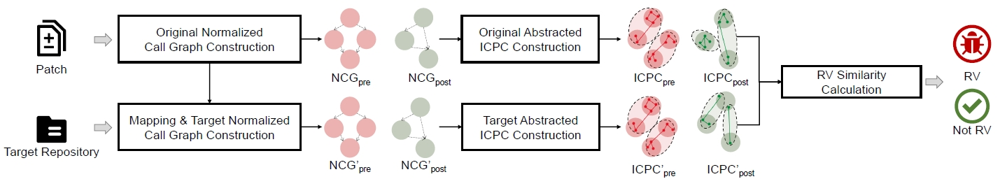

| **News :** 

| [2024-10-20] 🚀🚀🚀We have successfully detected 4,593 recurring vulnerabilities, with 307 confirmed by developers, and identified 73 new 0-day vulnerabilities across 15 repositories, receiving 5 CVE identifiers.

# AntMan

With the rapid development of open-source software, code reuse has become a common practice to accelerate development. However, it leads to inheritance from the original vulnerability, which recurs at the reusing repositories, known as recurring vulnerabilities (RVs). Traditional general-purpose vulnerability detection approaches struggle with scalability and adaptability, while learning-based approaches are often constrained by limited training datasets and are less effective against unseen vulnerabilities. Though specific recurring vulnerability detection (RVD) approaches have been proposed, their effectiveness across various RV characteristics remains unclear.

In this paper, we conduct a large-scale empirical study using a newly constructed RV dataset containing 4,569 RVs, achieving a 953% expansion over prior RV datasets. Our study analyzes the characteristics of RVs, evaluates the effectiveness of the state-of-the-art RVD approaches, and investigates the root causes of false positives and false negatives, yielding key insights. Inspired by these insights, we design AntMan, a novel RVD approach that identifies both explicit and implicit call relations with modified functions, then employs inter-procedural taint analysis and intra-procedural dependency slicing within those functions to generate comprehensive signatures, and finally incorporates a flexible matching to detect RVs. Our comprehensive evaluation has demonstrated the effectiveness, generality and practical usefulness in RVD. Notably, AntMan has successfully detected 4,593 recurring vulnerabilities, with 307 confirmed by developers, and identified 73 new 0-day vulnerabilities across 15 repositories, receiving 5 CVE identifiers.

The paper has been submitted to ISSTA 2025.  

This page lists the supplementary materials including the dataset, source code and reproducing scripts on our paper.

# Empirical Study

## Ground Truth Construction

- **Step 1: Vulnerability and Patch Collection.**

	We first selected the original vulnerability 𝑐𝑣𝑒𝑖𝑑 and its patch commit 𝑝𝑎𝑡 of 𝑟𝑒𝑝𝑜o from the NVD Data Feeds. After filtering for C/C++ vulnerabilities from 1 January 2020 to 1 January 2024, we collected a total of [**2,115 vulnerabilities with their associated patches**](https://github.com/AntMan-opensource/AntMan-opensource.github.io/tree/main/empirical/dataset/emperical_cve_list_raw.json). Then, we further excluded patches that modified only global declarations (e.g., macros and structures), C/C++ configuration files, or non-C/C++ files. This restricted our selection to a final dataset of [**2,088 vulnerabilities with their associated patches.**](https://github.com/AntMan-opensource/AntMan-opensource.github.io/tree/main/empirical/dataset/emperical_cve_list.json)

- **Step 2: Target Repository Collection.**

	To ensure a diverse set of RVs, we targeted high-profile GitHub repositories, selected based on star counts, while excluding archived or outdated repositories. By August 2024, we gathered the top 600 active C/C++ repositories. We then gathered all the released versions (i.e., 12,088) of the repositories. We then selected the first version released within each season to represent the evolution of code over specific periods, discarding all other versions from that period. If no version was available for a particular season, it was simply excluded. [**This process resulted in 3,873 distinct repositories with version tags**](https://github.com/AntMan-opensource/AntMan-opensource.github.io/tree/main/empirical/dataset/detected_repo_list.json).

- **Step 3: RV Detection and Confirmation.** 

  ​	We selected five state-of-the-art RVD approaches, including VUDDY, MVP, Movery, V1scan and FIRE.

  - **VUDDY**: we cloned the open-source code of [VUDDY](https://github.com/squizz617/vuddy), following their [instructions](https://github.com/squizz617/vulnDBGen/blob/f4cb690e43e5c4fe212a85317782cfe13a3c9bab/docs/%EC%B7%A8%EC%95%BD%EC%A0%90%20%EB%8D%B0%EC%9D%B4%ED%84%B0%EB%B2%A0%EC%9D%B4%EC%8A%A4%20%EC%83%9D%EC%84%B1%20%EC%86%94%EB%A3%A8%EC%85%98%20%EB%A7%A4%EB%89%B4%EC%96%BC%20V1.0.pdf), generated our own signatures and conducted detection on the all [repositories](https://github.com/AntMan-opensource/AntMan-opensource.github.io/tree/main/empirical/dataset/detected_repo_list.json), obtaining the detection [results](https://github.com/AntMan-opensource/AntMan-opensource.github.io/tree/main/empirical/baseline/VUDDY/results_emperical_with_origin.txt), then we conducted manual validation of all positive results by the authors to confirm the presence of RV, and then get the confirmed [results](https://github.com/AntMan-opensource/AntMan-opensource.github.io/tree/main/empirical/baseline/VUDDY/results_vuddy.xlsx).
  - **MVP**: cause it's not open-sourced, we just implemented [MVP](https://github.com/AntMan-opensource/AntMan-opensource.github.io/tree/main/empirical/baseline/MVP) based on their paper. Then we use it to generate signatures and detected all  [repositories](https://github.com/AntMan-opensource/AntMan-opensource.github.io/tree/main/empirical/dataset/detected_repo_list.json), obtaining the [results](https://github.com/AntMan-opensource/AntMan-opensource.github.io/tree/main/empirical/baseline/MVP/empirical_mvp.txt), then we conducted manual validation of all positive results by the authors to confirm the presence of RV, and then get the confirmed [results](https://github.com/AntMan-opensource/AntMan-opensource.github.io/tree/main/empirical/baseline/MVP/results_mvp.xlsx).
  - **Movery**: Since MOVERY does not provide open-source code for signature generation, we began by implementing its signature generation stages ourselves, using our original vulnerability list to create the required signatures. The source code is shown in [signatureGeneration](https://github.com/AntMan-opensource/AntMan-opensource.github.io/tree/main/empirical/baseline/MOVERY/signatureGeneration). We then tested [MOVERY](https://hub.docker.com/r/seunghoonwoo/movery-public) in a Docker environment, obtaining preliminary detection results in [results_movery.txt](https://github.com/AntMan-opensource/AntMan-opensource.github.io/tree/main/empirical/baseline/MOVERY/empirical_movery.txt). Following this, we conducted a manual validation of all positive results in collaboration with the original authors to confirm the presence of RV, resulting in the final validated outcomes, documented in [results_movery.xlsx](https://github.com/AntMan-opensource/AntMan-opensource.github.io/tree/main/empirical/baseline/MOVERY/results_movery.xlsx).
  -  **V1scan**: We just run V1scan using [docker](https://hub.docker.com/r/seunghoonwoo/v1scan_code) following the [instructions](https://github.com/WOOSEUNGHOON/V1SCAN-public/blob/main/README.md),  obtaining the [results](https://github.com/AntMan-opensource/AntMan-opensource.github.io/tree/main/empirical/baseline/V1SCAN/empirical_v1scan.txt), then we conducted manual validation of all positive results by the authors to confirm the presence of RV, and then get the confirmed [results](https://github.com/AntMan-opensource/AntMan-opensource.github.io/tree/main/empirical/baseline/V1SCAN/results_v1scan.xlsx).
  -  **FIRE**: We cloned the open-source code of [FIRE](https://github.com/CGCL-codes/FIRE), followed their [instructions](https://github.com/CGCL-codes/FIRE/blob/main/readme.md) to conduct our detection process. We performed detection across all repositories listed in [detected_repo_list.json](https://github.com/AntMan-opensource/AntMan-opensource.github.io/tree/main/empirical/dataset/detected_repo_list.json), and obtained the initial detection [results](https://github.com/AntMan-opensource/AntMan-opensource.github.io/tree/main/empirical/baseline/FIRE/result). Following this automated detection, we manually validated all positive results alongside the original authors to confirm the presence of RV, leading to the final validated results, available in [results_fire.xlsx](https://github.com/AntMan-opensource/AntMan-opensource.github.io/tree/main/empirical/baseline/FIRE/results_fire.xlsx).

	For each patch, we ran five RVD approaches to identify RVs in each target project, This process generated samples that were detected by at least one RVD approach. Human experts then verified the detected samples. This process identified **3,834 positive samples** and **4,469 negative samples**. We release the confirmed data: [confirmation.xlsx](https://github.com/AntMan-opensource/AntMan-opensource.github.io/tree/main/empirical/dataset/confirmation.xlsx) with [Kappa](https://github.com/AntMan-opensource/AntMan-opensource.github.io/blob/main/empirical/dataset/empirical_confirmation_mark.xlsx) of 0.934.

	Moreover, as RVs can persist across multiple versions, the experts extended their manual analysis by recursively checking earlier and later versions of target repositories where no sample was identified by RVD, continuing until no further vulnerable versions were found. This process expands **735 positive samples**. Ultimately, we gathered **4,569 positive samples across 1,300 target repositories and 4,469 negative samples across 1,234 repositories.**  We release whole [ground truth](https://github.com/AntMan-opensource/AntMan-opensource.github.io/tree/main/empirical/dataset/groundtruth.xlsx) with [Kappa](https://github.com/AntMan-opensource/AntMan-opensource.github.io/blob/main/empirical/dataset/empirical_expansion_mark.xlsx) of 0.936 for sample expansion.

## RQ1 Characteristic Analysis of RVs.

We focus on three characteristics of RVs, **similarity types**, **patch scopes**, and **∗-day vulnerability types**. We analyzed the characteristics of RVs in two contexts: (1) RVs recurring within the same repository (referred to as the “original repository”), and (2) RVs recurring in different repositories (referred to as the “transferred repository").

To accurately assess the characteristics of RVs, follow these steps:

- Enter to the `extraction` folder and clone the repositories mentioned in the [cve_list](https://github.com/AntMan-opensource/AntMan-opensource.github.io/blob/main/empirical/dataset/emperical_cve_list.json) and run the [main.py](https://github.com/AntMan-opensource/AntMan-opensource.github.io/blob/main/empirical/RQ1/extraction/main.py) to extract the influenced functions. The output file will be [cve_origin_code.json](https://drive.google.com/file/d/1l2KheEowF00fk2-5YRVnXLFkPIYK6wS8/view?usp=drive_link).

  ```bash
  python main.py
  ```

- Enter to the `RQ1` folder and clone the target repositories mentioned in our [groundtruth](https://github.com/AntMan-opensource/AntMan-opensource.github.io/tree/main/empirical/dataset/groundtruth.xlsx) and run the [extract_target_code.py](https://github.com/AntMan-opensource/AntMan-opensource.github.io/blob/main/empirical/RQ1/extract_target_code.py) to extract the target functions. The output file will be [transfer_code.json](https://drive.google.com/file/d/1Pk3-YyRP8fkDq2PhOxkAmgeiEh2cYxnX/view?usp=drive_link).

  ```
  python extract_target_code.py
  ```

- Run `patch_parse.py` to get the information of the patch, which is [patch_info.json](https://github.com/AntMan-opensource/AntMan-opensource.github.io/blob/main/empirical/RQ1/datas/patch_info.json)

  ```
  python patch_parse.py
  ```
- Run `RQ1_table1.py` to get the characteristics of RVs, which are **similarity types**, **patch scopes**. The output file is [results_RQ1.json ](https://github.com/AntMan-opensource/AntMan-opensource.github.io/blob/main/empirical/RQ1/datas/results_RQ1.json)and the characteristics of each result, [result_feature.json](https://github.com/AntMan-opensource/AntMan-opensource.github.io/blob/main/empirical/RQ1/datas/result_feature.json).
  ```
  python RQ1_table1.py
  ```
- To get the **∗-day vulnerability types**, just run the python file [n-day_vulnerability_type.py](https://github.com/AntMan-opensource/AntMan-opensource.github.io/blob/main/empirical/RQ1/n-day_vulnerability_type.py) and get the original results, which are [origin_sharing_logic.json](https://github.com/AntMan-opensource/AntMan-opensource.github.io/blob/main/empirical/RQ1/datas/origin_sharing_logic.json) and [transfer_sharing_logic.json](https://github.com/AntMan-opensource/AntMan-opensource.github.io/blob/main/empirical/RQ1/datas/transfer_sharing_logic.json). After human confirmation, you will gain the final results of all 0-day vulnerabilities in [origin_sharing_logic_checked.json](https://github.com/AntMan-opensource/AntMan-opensource.github.io/blob/main/empirical/RQ1/datas/origin_sharing_logic_checked.json) and [transferred_sharing_logic_checked.json](https://github.com/AntMan-opensource/AntMan-opensource.github.io/blob/main/empirical/RQ1/datas/transferred_sharing_logic_checked.json).

  ```
  python n-day_vulnerability_type.py
  ```

  Then, just run the [n-day_vulnerability_feature.py](https://github.com/AntMan-opensource/AntMan-opensource.github.io/blob/main/empirical/RQ1/n-day_vulnerability_feature.py), you will gain the feature of 0-day vulnerabilities which is in [origin_sharing_logic_feature.json](https://github.com/AntMan-opensource/AntMan-opensource.github.io/blob/main/empirical/RQ1/datas/origin_sharing_logic_feature.json)  and [transfer_sharing_logic_feature.json](https://github.com/AntMan-opensource/AntMan-opensource.github.io/blob/main/empirical/RQ1/datas/transfer_sharing_logic_feature.json).
  
  ```
  python n-day_vulnerability_feature.py
  ```
## RQ2 Effectiveness Evaluation of RVD. 

- To get the effectiveness of each RVD approach, just run [RQ2_table2.py](https://github.com/AntMan-opensource/AntMan-opensource.github.io/blob/main/empirical/RQ2/RQ2_table2.py) and get the results [results_RQ2.json](https://github.com/AntMan-opensource/AntMan-opensource.github.io/blob/main/empirical/RQ2/datas/results_RQ2.json), which is shown in Table 2.
  ```
  python RQ2_table2.py
  ```

## RQ3 FP/FN Analysis of RVD.

- We began by sampling FPs and FNs for each RVD approach to reduce manual cost, resulting in 173, 814, 427, 208, 299 FPs, 881, 1,180, 314, 1,323, 879 FNs for the five approaches respectively. Sampling was performed at a 99% confidence level with a 3% confidence interval. We determined the root cause in each strategy that could cause FPs and FNs. The sampled data and its root cause is shown in [FP_samples_per_tool.xlsx](https://github.com/AntMan-opensource/AntMan-opensource.github.io/blob/main/empirical/RQ3/datas/FP_samples_per_tool.xlsx) and [FN_samples_per_tool.xlsx](https://github.com/AntMan-opensource/AntMan-opensource.github.io/blob/main/empirical/RQ3/datas/FN_samples_per_tool.xlsx) To ensure inter-rater reliability, Cohen’s Kappa was calculated, yielding 0.937 for [FPs](https://github.com/AntMan-opensource/AntMan-opensource.github.io/blob/main/empirical/RQ3/datas/FP_samples_expert_checked.xlsx) and 0.949 for [FNs](https://github.com/AntMan-opensource/AntMan-opensource.github.io/blob/main/empirical/RQ3/datas/FN_samples_expert_checked.xlsx).
- Just run [fp_rootcause.py](https://github.com/AntMan-opensource/AntMan-opensource.github.io/blob/main/empirical/RQ3/fp_rootcause.py) and [fn_rootcause.py](https://github.com/AntMan-opensource/AntMan-opensource.github.io/blob/main/empirical/RQ3/fn_rootcause.py) to get the top three strategies that Introduced the most FPs and FNs, which is shown table 4.

# AntMan

## Environment Setup:

- ***python***: 3.11+

- ***[joern](https://docs.joern.io/installation)***

- ***[tree-sitter](https://tree-sitter.github.io/tree-sitter/)***: for function elemtents extraction.

  Our utilized versions: Python 3.11.8, joern 2.260 and some other relevant dependent packages listed in [requirements.txt](src/requirements.txt) on Ubuntu 18.04.

## Methodology Implementation



[The Prototype of AntMan](https://github.com/AntMan-opensource/AntMan-opensource.github.io/tree/main/src).

## Evaluation

### RQ4 Effectiveness Evaluation

- We assessed AntMan using the ground truth and compared it to the five baselines. The results of AntMan is shown in [raw_results.json](evaluation/RQ4/raw_results.json) and you can just run the script `effectiveness.py` to get some [data](evaluation/RQ4/results_RQ4.json) shown Table 5 and the json format of the AntMan's [results](evaluation/RQ4/results_antman_effectiveness.json).

    ```
    python effectiveness.py
    ```
    
    **Some description used in this script is as follows:**
    
    - `cve_lists.json`: the CVE list of original vulnerability used to construct our ground truth
    
    - `results_features.json`: the feature of RVs in our ground truth which is extracted in RQ1.
    
    - `results_other_tools.json`: the json format of our ground truth, splitting with the detected tools.
    
    - `ground truth.json`: the json format of our ground truth.

### RQ5 Ablation Study

- We created six ablated versions of AntMan (i.e., w/o *norm*, w/o p<sup>intra</sup>, w/o *p<sup>inter</sup>*,  w/o *abs*, w/o *w* and w/ *LD*). To get the ablation study results which is shown in Table 6 of our paper, just replace the corresponding scripts in AntMan with those in the directory [w_o_norm](https://github.com/AntMan-opensource/AntMan-opensource.github.io/tree/main/evaluation/RQ5/w_o_norm), [w_o_pintra](https://github.com/AntMan-opensource/AntMan-opensource.github.io/tree/main/evaluation/RQ5/w_o_pintra), [w_o_pinter](https://github.com/AntMan-opensource/AntMan-opensource.github.io/tree/main/evaluation/RQ5/w_o_pinter), [w_o_abs](https://github.com/AntMan-opensource/AntMan-opensource.github.io/tree/main/evaluation/RQ5/w_o_abs), [w_o_w](https://github.com/AntMan-opensource/AntMan-opensource.github.io/tree/main/evaluation/RQ5/w_o_w), [w_o_unixcoder](https://github.com/AntMan-opensource/AntMan-opensource.github.io/tree/main/evaluation/RQ5/w_o_unixcoder),  respectively, and following the usage instructions outlined above to detect all [repositories](https://github.com/AntMan-opensource/AntMan-opensource.github.io/tree/main/empirical/dataset/detected_repo_list.json). Then follow the steps shown in RQ4 to get all metrics. The final results is shown in [results_ablation.json](https://github.com/AntMan-opensource/AntMan-opensource.github.io/tree/main/evaluation/RQ5/results_ablation.json).

### RQ6 Parameter Sensitivity Analysis

- We conducted a sensitivity analysis to assess the impact of various thresholds (*th<sub>vul</sub>, th<sub>fix</sub>, pro<sub>vul</sub>, pro<sub>fix</sub>*) on AntMan’s performance. Just modify the corresponding configurations in the detection script [Detection.py](https://github.com/AntMan-opensource/AntMan-opensource.github.io/tree/main/src/hungarian/Detection.py), and following the usage instructions outlined above to detect all [repositories](https://github.com/AntMan-opensource/AntMan-opensource.github.io/tree/main/empirical/dataset/detected_repo_list.json). To get the Figure 2 in our paper, you need to :

  - run `python sensitivity_icpcvul_draw.py` point Figure 2(a) in RQ6

  - run `python sensitivity_icpcfix_draw.py` point Figure 2(b) in RQ6

  - run `python sensitivity_ICPCVUL__draw.py` point Figure 2(c) in RQ6

  - run `python sensitivity_ICPCFIX__draw.py` point Figure 2(d) in RQ6


### RQ7 Generality Evaluation

- **Dataset:** AntMan was designed based on insights from our empirical study. To evaluate its generality, we further constructed a new dataset following the same procedure as in empirical study. Specifically, 

  - We collected the newest C/C++ vulnerabilities reported between 1 January 2024 and 7 August 2024, gathering a set of [186 vulnerabilities ](https://github.com/AntMan-opensource/AntMan-opensource.github.io/tree/main/evaluation/RQ7/generality_cve_list.json)with their corresponding patches.

  - We then used these original vulnerability patches as inputs to detect RVs by the existing RVD approaches and AntMan. After sample confirmation and expansion, we finally gathered 813 positive and 260 negative [samples](https://github.com/AntMan-opensource/AntMan-opensource.github.io/tree/main/evaluation/RQ7/generality_dataset.xlsx) with Cohen’s Kappa coefficient of [0.958](https://github.com/AntMan-opensource/AntMan-opensource.github.io/tree/main/evaluation/RQ7/generality_confirmation_mark.xlsx) and [0.969](https://github.com/AntMan-opensource/AntMan-opensource.github.io/tree/main/evaluation/RQ7/generality_expansion_mark.xlsx), respectively. 

- **General-Purpose Vulnerability Detection Approach Selection.** We selected two state-of-the-art learning-based vulnerability detection approaches in our generality evaluation:

  - **SySeVR:**  we cloned the open-source code of [SySeVR](https://github.com/SySeVR/SySeVR), following the [instructions](https://github.com/SySeVR/SySeVR/blob/master/README.md) and the [paper](https://arxiv.org/abs/1807.06756) to reproduce it.
  - **DeepDFA:**we cloned the open-source code of [DeepDFA](https://github.com/ISU-PAAL/DeepDFA), following the [instructions](https://github.com/ISU-PAAL/DeepDFA/blob/master/README.md) and the [paper](https://github.com/ISU-PAAL/DeepDFA/blob/master/paper.pdf) to reproduce it.

  We trained the models on our ground truth dataset, and assessed their performance on our new dataset as the testing dataset.

- **Overall results:** 

  - To get the six RVD approaches including AntMan, we merged all results they detected into json format, which is shown in [generality_rvd_results.json](https://github.com/AntMan-opensource/AntMan-opensource.github.io/tree/main/evaluation/RQ7/generality_rvd_results.json), to get its metrics that is shown in Table 7 in our paper, just run the script [generality.py](https://github.com/AntMan-opensource/AntMan-opensource.github.io/blob/main/evaluation/RQ7/generality.py), the metrics will be output in [rvd_generality_metrics.json](https://github.com/AntMan-opensource/AntMan-opensource.github.io/tree/main/evaluation/RQ7/rvd_generality_metrics.json)

  ```bash
  python generality.py
  ```

  - we reproduce these methods and extract the metrics they output to the console. The extracted metrics are then saved in the file  [vd_generality_metrics.json](https://github.com/AntMan-opensource/AntMan-opensource.github.io/tree/main/evaluation/RQ7/vd_generality_metrics.json)

### RQ8 0-day Detection Capability

- To assess the 0-day vulnerability detection capability of AntMan, we compared AntMan with the five RVD approaches and the two learning-based approaches in terms of the pro-portion of detected 0-day vulnerabilities in our ground truth dataset and generality dataset. The results is shown in [results_0day.json](https://github.com/AntMan-opensource/AntMan-opensource.github.io/tree/main/evaluation/RQ8/results_0day.json)

### RQ9 Efficiency Evaluation

- We measured the average time taken to detect RVs in a single repository using all the original vulnerabilities collected in empirical study.  The results is shown in [results_efficiency.json](evaluation/RQ9/results_efficiency.json)

### RQ10 Usefulness Evaluation

- AntMan notified target repositories of 274 1/N-day vulnerabilities with 188 of them confirmed, and notified target repositories of 73 0-day vulnerabilities with 67 of them confirmed. We reported 21 unique 0-day vulnerabilities to CVE with 5 CVE identifiers assigned.
