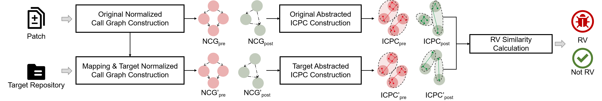

|**<font size=5>✨✨✨News :</font>**<br/><br/>[2024-03-21] 🚀🚀🚀We have released our ground truth and reproducing materials for our research questions of empirical study.<br/>[2024-09-25] 🚀🚀🚀We have released our tool, and welcome to share your feedback with us.<br/>[2024-10-15] 🚀🚀🚀We have notified developers of 274 1/N-day vulnerabilities, with 188 confirmed.<br/>[2024-10-15] 🚀🚀🚀We have notified developers of 73 0-day vulnerabilities, with 67 confirmed. <br/>[2024-10-20] 🚀🚀🚀We have reported 21 unique 0-day vulnerabilities to CVE, with 5 CVE identifiers assigned.<br/>[2024-11-01] 🚀🚀🚀Our paper is submitted to ISSTA 2025.  <br/>[2024-11-20] 📢📢📢We have provided the results of our [literature survey](#survey) on vulnerability detection.  <br/>[2024-12-20] 📢📢📢We have done a human study to evaluate the usefulness of our approach. Thanks for all participants🥳🥳🥳 <br/>[2024-12-31] 📢📢📢We have provided [supplementary materials](https://github.com/AntMan-opensource/AntMan-opensource.github.io/tree/main/evaluation/extra_experiments) on our extra ablation study, generality evaluation and industrial tool analysis.  <br/>[2024-12-31] 📢📢📢We have provided the [results](empirical/RQ1/datas/results_call_relations.json) for deeper analysis on Finding 2.  <br/>

# ✨✨WHAT IS NEW

## <a id="survey">📢📢📢 **Literature survey**</a>

we conducted a literature review starting with FIRE (2024), the latest work on RVD. Using a snowball approach, we identified [278](docs/literature_software_vulnerability.csv) from [1,406 papers](docs/literature_all.csv) on traditional approaches for detecting software vulnerabilities since 2014 via Google Scholar, Semantic Scholar, Scopus, Crossref. We applied exclusion criteria to ensure relevance and comparability. We excluded 67 empirical studies that did not propose new detection approaches, 158 domain-specific papers focusing on specific vulnerabilities like XSS, smart contracts, etc., 32 papers addressing general-purpose vulnerability detection without recurring vulnerability focus, 9 papers covering data augmentation techniques, surveys, or benchmarks, and 9 papers specifically dealing with binary level RVD or source code based RVD that requires dynamic execution. After applying these criteria, we identified five representative RVD approaches, i.e., VUDDY, MVP, MOVERY, V1scan, and FIRE.

## <a id="experiment">📢📢📢**Supplementary materials on our extra ablation study, generality evaluation and industrial tool analysis.**</a>

1. **Ablation study on UniXcoder and L2 norm**. We have done an extra ablation experiment which can show the effectiveness of UniXcoder and L2 norm. To get the ablation study results of AntMan w/ CodeBERT and w/ L1. We have released the [code](https://github.com/AntMan-opensource/AntMan-opensource.github.io/tree/main/evaluation/extra_experiments/extra_ablation/). For AntMan w/ CodeBERT, you can just download the [microsoft/codebert-base](https://huggingface.co/microsoft/codebert-base) and replace the UniXcoder [model](https://github.com/AntMan-opensource/AntMan-opensource.github.io/tree/main/src/sim_model/model) with the CodeBERT model. For AntMan w/ L1, you can just replace the *SimilarityService.py* with the [code](evaluation/extra_experiments/extra_ablation/w_l1/SimilarityService.py). The other steps are similar to AntMan.
2. **Generality evaluation on Java.** We have adapted [MVP](https://github.com/AntMan-opensource/AntMan-opensource.github.io/tree/main/empirical/baseline/adapted_java_MVP), [VUDDY](https://github.com/AntMan-opensource/AntMan-opensource.github.io/tree/main/empirical/baseline/adapted_java_VUDDY) and [AntMan](https://github.com/AntMan-opensource/AntMan-opensource.github.io/tree/main/src) to detect recurring vulnerability on Java. The generality dataset and the evaluation results are shown in [extra_generality directory](https://github.com/AntMan-opensource/AntMan-opensource.github.io/tree/main/evaluation/extra_experiments/extra_generality)
3. **Comparing industrial tools.** We have evaluated Checkmarx and flawfinder on groundtruth dataset. The results of Fortify and Checkmarx are shown in [flawfinder_results](evaluation/extra_experiments/static_tool_analysis/flawfinder_results.csv) and [checkmarx_results](https://github.com/AntMan-opensource/AntMan-opensource.github.io/tree/main/evaluation/extra_experiments/static_tool_analysis/checkmarx_results) respectively.

# Abstraction

In this paper, we conduct a large-scale empirical study using a newly constructed RV dataset containing 4,569 RVs, achieving a 953% expansion over prior RV datasets. Our study analyzes the characteristics of RVs, evaluates the effectiveness of the state-of-the-art RVD approaches, and investigates the root causes of false positives and false negatives, yielding key insights. Inspired by these insights, we design AntMan, a novel RVD approach that identifies both explicit and implicit call relations with modified functions, then employs inter-procedural taint analysis and intra-procedural dependency slicing within those functions to generate comprehensive signatures, and finally incorporates a flexible matching to detect RVs. Our comprehensive evaluation has demonstrated the effectiveness, generality and practical usefulness in RVD. Notably, AntMan has successfully detected 4,593 recurring vulnerabilities, with 307 confirmed by developers, and identified 73 new 0-day vulnerabilities across 15 repositories, receiving 5 CVE identifiers.

# Empirical Study

## Ground Truth Construction

- **Step 1: Vulnerability and Patch Collection.**

	We initially selected original vulnerabilities along with their patches from January 1, 2020, to January 1, 2024, totaling [2,115 vulnerabilities with their associated patches](https://github.com/AntMan-opensource/AntMan-opensource.github.io/tree/main/empirical/dataset/emperical_cve_list_raw.json). Next, we refined this selection by excluding patches that modified only global declarations (such as macros and structures), C/C++ configuration files, or non-C/C++ files. This process yielded a final dataset of [2,088 vulnerabilities with their associated patches.](https://github.com/AntMan-opensource/AntMan-opensource.github.io/tree/main/empirical/dataset/emperical_cve_list.json)

- **Step 2: Target Repository Collection.**

	To ensure diversity among RVs, we targeted high-profile GitHub repositories, selecting 600 active C/C++ projects based on star counts, excluding archived or outdated ones as of August 2024. We gathered 12,088 released versions, choosing the first version from each season to track code evolution while discarding others. If no version existed for a season, it was excluded. [This process resulted in 3,873 distinct repositories with version tags](https://github.com/AntMan-opensource/AntMan-opensource.github.io/tree/main/empirical/dataset/detected_repo_list.json).

- **Step 3: RV Detection and Confirmation.** 

  ​	We selected five state-of-the-art RVD approaches, including VUDDY, MVP, Movery, V1scan and FIRE.

  - **VUDDY**: We cloned the open-source code of [VUDDY](https://github.com/squizz617/vuddy), following their [instructions](https://github.com/squizz617/vulnDBGen/blob/f4cb690e43e5c4fe212a85317782cfe13a3c9bab/docs/%EC%B7%A8%EC%95%BD%EC%A0%90%20%EB%8D%B0%EC%9D%B4%ED%84%B0%EB%B2%A0%EC%9D%B4%EC%8A%A4%20%EC%83%9D%EC%84%B1%20%EC%86%94%EB%A3%A8%EC%85%98%20%EB%A7%A4%EB%89%B4%EC%96%BC%20V1.0.pdf), generated our own signatures and conducted detection on the all [repositories](https://github.com/AntMan-opensource/AntMan-opensource.github.io/tree/main/empirical/dataset/detected_repo_list.json), obtaining the [detection results](https://github.com/AntMan-opensource/AntMan-opensource.github.io/tree/main/empirical/baseline/VUDDY/results_emperical_with_origin.txt), then we conducted manual validation of all positive results by the authors to confirm the presence of RV, and then get the [confirmed results](https://github.com/AntMan-opensource/AntMan-opensource.github.io/tree/main/empirical/baseline/VUDDY/results_vuddy.xlsx).
  - **MVP**: Cause MVP is not open-sourced, we just implemented [MVP](https://github.com/AntMan-opensource/AntMan-opensource.github.io/tree/main/empirical/baseline/MVP) based on their paper. Then we use it to generate signatures and detected all  [repositories](https://github.com/AntMan-opensource/AntMan-opensource.github.io/tree/main/empirical/dataset/detected_repo_list.json), obtaining the [detection results](https://github.com/AntMan-opensource/AntMan-opensource.github.io/tree/main/empirical/baseline/MVP/empirical_mvp.txt), then we conducted manual validation of all positive results by the authors to confirm the presence of RV, and then get the [confirmed results](https://github.com/AntMan-opensource/AntMan-opensource.github.io/tree/main/empirical/baseline/MVP/results_mvp.xlsx).
  - **MOVERY**: Cause MOVERY is not completely open-sourced, we just implemented [MOVERY](https://github.com/AntMan-opensource/AntMan-opensource.github.io/tree/main/empirical/baseline/MOVERY/signatureGeneration) based on their paper. Then we use it to generate signatures and detected all [repositories](https://github.com/AntMan-opensource/AntMan-opensource.github.io/tree/main/empirical/dataset/detected_repo_list.json), obtaining preliminary [detection results](https://github.com/AntMan-opensource/AntMan-opensource.github.io/tree/main/empirical/baseline/MOVERY/empirical_movery.txt), then we conducted manual validation of all positive results by the authors to confirm the presence of RV, and then get the [confirmed results](https://github.com/AntMan-opensource/AntMan-opensource.github.io/tree/main/empirical/baseline/MOVERY/results_movery.xlsx).
  -  **V1scan**: We just run [V1scan](https://hub.docker.com/r/seunghoonwoo/v1scan_code) using docker following the [instructions](https://github.com/WOOSEUNGHOON/V1SCAN-public/blob/main/README.md), generated our own signatures and conducted detection on the all [repositories](https://github.com/AntMan-opensource/AntMan-opensource.github.io/tree/main/empirical/dataset/detected_repo_list.json), obtaining the [detection results](https://github.com/AntMan-opensource/AntMan-opensource.github.io/tree/main/empirical/baseline/V1SCAN/empirical_v1scan.txt), then we conducted manual validation of all positive results by the authors to confirm the presence of RV, and then get the [confirmed results](https://github.com/AntMan-opensource/AntMan-opensource.github.io/tree/main/empirical/baseline/V1SCAN/results_v1scan.xlsx).
  -  **FIRE**: We cloned the open-source code of [FIRE](https://github.com/CGCL-codes/FIRE), following their [instructions](https://github.com/CGCL-codes/FIRE/blob/main/readme.md), generated our own signatures and conducted detection on the all [repositories](https://github.com/AntMan-opensource/AntMan-opensource.github.io/tree/main/empirical/dataset/detected_repo_list.json), and obtained the initial [detection results](https://github.com/AntMan-opensource/AntMan-opensource.github.io/tree/main/empirical/baseline/FIRE/result). Following this automated detection, we manually validated all positive results alongside the original authors to confirm the presence of RV, and then get the [confirmed results](https://github.com/AntMan-opensource/AntMan-opensource.github.io/tree/main/empirical/baseline/FIRE/results_fire.xlsx).


- **Kappa**
  - [Sample verification kappa: 0.934](https://github.com/AntMan-opensource/AntMan-opensource.github.io/blob/main/empirical/dataset/empirical_confirmation_mark.xlsx)
    - We identified **3,834 positive samples** and **4,469 negative samples** after using these five RVD approaches to detect RVs, which is released in  [confirmation.xlsx](https://github.com/AntMan-opensource/AntMan-opensource.github.io/tree/main/empirical/dataset/confirmation.xlsx)  
  - [Sample expansion kappa: 0.936](https://github.com/AntMan-opensource/AntMan-opensource.github.io/blob/main/empirical/dataset/empirical_expansion_mark.xlsx)
    - We extended the confirmation RVs  by recursively checking earlier and later versions of target repositories where no sample was identified by RVD, continuing until no further vulnerable versions were found. This process expands **735 positive samples**. Ultimately, we gathered **4,569 positive samples across 1,300 target repositories and 4,469 negative samples across 1,234 repositories**in our [ground truth](https://github.com/AntMan-opensource/AntMan-opensource.github.io/tree/main/empirical/dataset/groundtruth.xlsx).

## RQ1 Characteristic Analysis of RVs.

We focus on three characteristics of RVs, **similarity types**, **patch scopes**, and **∗-day vulnerability types**. We analyzed the characteristics of RVs in two contexts: (1) RVs recurring within the same repository (referred to as the “original repository”), and (2) RVs recurring in different repositories (referred to as the “transferred repository").

To accurately assess the characteristics of RVs, follow these steps:

- Enter to the `extraction` folder and clone the repositories mentioned in the [cve_list](https://github.com/AntMan-opensource/AntMan-opensource.github.io/blob/main/empirical/dataset/emperical_cve_list.json) and run the [main.py](https://github.com/AntMan-opensource/AntMan-opensource.github.io/blob/main/empirical/RQ1/extraction/main.py) to extract the influenced functions. The output file will be [cve_origin_code.json](https://drive.google.com/file/d/1l2KheEowF00fk2-5YRVnXLFkPIYK6wS8/view?usp=drive_link).

  ```bash
  python main.py
  ```

- Enter to the `RQ1` folder and clone the target repositories mentioned in our [groundtruth](https://github.com/AntMan-opensource/AntMan-opensource.github.io/tree/main/empirical/dataset/groundtruth.xlsx) and run the [extract_target_code.py](https://github.com/AntMan-opensource/AntMan-opensource.github.io/blob/main/empirical/RQ1/extract_target_code.py) to extract the target functions. The output file will be [transfer_code.json](https://drive.google.com/file/d/1Pk3-YyRP8fkDq2PhOxkAmgeiEh2cYxnX/view?usp=drive_link).

  ```
  python extract_target_code.py
  ```

- Run [patch_parse.py](https://github.com/AntMan-opensource/AntMan-opensource.github.io/blob/main/empirical/RQ1/patch_parse.py) to get the information of the patch, which is [patch_info.json](https://github.com/AntMan-opensource/AntMan-opensource.github.io/blob/main/empirical/RQ1/datas/patch_info.json)

  ```
  python patch_parse.py
  ```
- Run [RQ1_table1.py](https://github.com/AntMan-opensource/AntMan-opensource.github.io/blob/main/empirical/RQ1/RQ1_table1.py) to get the characteristics of RVs, which are **similarity types**, **patch scopes**. The output file is [results_RQ1.json ](https://github.com/AntMan-opensource/AntMan-opensource.github.io/blob/main/empirical/RQ1/datas/results_RQ1.json)and the characteristics of each result, [result_feature.json](https://github.com/AntMan-opensource/AntMan-opensource.github.io/blob/main/empirical/RQ1/datas/result_feature.json).
  ```
  python RQ1_table1.py
  ```
- To get the **∗-day vulnerability types**, just run the python file [n-day_vulnerability_type.py](https://github.com/AntMan-opensource/AntMan-opensource.github.io/blob/main/empirical/RQ1/n-day_vulnerability_type.py) and get the original results, which are [origin_sharing_logic.json](https://github.com/AntMan-opensource/AntMan-opensource.github.io/blob/main/empirical/RQ1/datas/origin_sharing_logic.json) and [transfer_sharing_logic.json](https://github.com/AntMan-opensource/AntMan-opensource.github.io/blob/main/empirical/RQ1/datas/transfer_sharing_logic.json). After human confirmation, you will gain the final results of all 0-day vulnerabilities in [origin_sharing_logic_checked.json](https://github.com/AntMan-opensource/AntMan-opensource.github.io/blob/main/empirical/RQ1/datas/origin_sharing_logic_checked.json) and [transferred_sharing_logic_checked.json](https://github.com/AntMan-opensource/AntMan-opensource.github.io/blob/main/empirical/RQ1/datas/transferred_sharing_logic_checked.json).

  ```
  python n-day_vulnerability_type.py
  ```

  Then, just run the [n-day_vulnerability_feature.py](https://github.com/AntMan-opensource/AntMan-opensource.github.io/blob/main/empirical/RQ1/n-day_vulnerability_feature.py), you will gain the feature of 0-day vulnerabilities which is in [origin_sharing_logic_feature.json](https://github.com/AntMan-opensource/AntMan-opensource.github.io/blob/main/empirical/RQ1/datas/origin_sharing_logic_feature.json)  and [transfer_sharing_logic_feature.json](https://github.com/AntMan-opensource/AntMan-opensource.github.io/blob/main/empirical/RQ1/datas/transfer_sharing_logic_feature.json).
  
  ```
  python n-day_vulnerability_feature.py
  ```

## RQ2 Effectiveness Evaluation of RVD. 

- To get the effectiveness of each RVD approach, just run [RQ2_table2.py](https://github.com/AntMan-opensource/AntMan-opensource.github.io/blob/main/empirical/RQ2/RQ2_table2.py) and get the results [results_RQ2.json](https://github.com/AntMan-opensource/AntMan-opensource.github.io/blob/main/empirical/RQ2/datas/results_RQ2.json), which is shown in Table 2.
  ```
  python RQ2_table2.py
  ```

## RQ3 FP/FN Analysis of RVD.

- We began by sampling FPs and FNs for each RVD approach to reduce manual cost, resulting in 173, 814, 427, 208, 299 FPs, 881, 1,180, 314, 1,323, 879 FNs for the five approaches respectively. Sampling was performed at a 99% confidence level with a 3% confidence interval. We determined the root cause in each strategy that could cause FPs and FNs. The sampled data and its root cause is shown in [FP_samples_per_tool.xlsx](https://github.com/AntMan-opensource/AntMan-opensource.github.io/blob/main/empirical/RQ3/datas/FP_samples_per_tool.xlsx) and [FN_samples_per_tool.xlsx](https://github.com/AntMan-opensource/AntMan-opensource.github.io/blob/main/empirical/RQ3/datas/FN_samples_per_tool.xlsx) To ensure inter-rater reliability, Cohen’s Kappa was calculated, yielding 0.937 for [FPs](https://github.com/AntMan-opensource/AntMan-opensource.github.io/blob/main/empirical/RQ3/datas/FP_samples_expert_checked.xlsx) and 0.949 for [FNs](https://github.com/AntMan-opensource/AntMan-opensource.github.io/blob/main/empirical/RQ3/datas/FN_samples_expert_checked.xlsx).

- Just run [fp_rootcause.py](https://github.com/AntMan-opensource/AntMan-opensource.github.io/blob/main/empirical/RQ3/fp_rootcause.py) and [fn_rootcause.py](https://github.com/AntMan-opensource/AntMan-opensource.github.io/blob/main/empirical/RQ3/fn_rootcause.py) to get the top three strategies that Introduced the most FPs and FNs, which is shown table 4.

  ```
  python fp_rootcause.py # for FP
  python fn_rootcause.py # for FN
  ```

# AntMan

## Environment Setup:

- **python**: 3.11.8

- **joern**: 2.260

  The installation process for Joern can be found at https://docs.joern.io/installation.

- **tree-sitter**: 0.22.6

  The installation process for tree-sitter can be found at https://tree-sitter.github.io/tree-sitter/

- Other relevant dependent packages listed in [requirements.txt](src/requirements.txt)

## Methodology Implementation

We have proposed AntMan to detect RVs more effectively, including five modules: original normalized call graph construction, original abstracted ICPC construction, mapping & target normalized call graph construction, target abstracted ICPC construction and RV similarity calculation. More details is shown in [the prototype of AntMan](https://github.com/AntMan-opensource/AntMan-opensource.github.io/tree/main/src).



## Evaluation

### RQ4 Effectiveness Evaluation

- We assessed AntMan using the ground truth and compared it to the five baselines. The results of AntMan is shown in [raw_results.json](evaluation/RQ4/raw_results.json) and you can just run the script [effectiveness.py](https://github.com/AntMan-opensource/AntMan-opensource.github.io/blob/main/evaluation/RQ4/get_effectiveness.py) to get some [data](evaluation/RQ4/results_RQ4.json) shown Table 5 and the json format of the AntMan's [results](evaluation/RQ4/results_antman_effectiveness.json).

    ```
    python effectiveness.py
    ```
    
    **Some description used in this script is as follows:**
    
    - `cve_lists.json`: the CVE list of original vulnerability used to construct our ground truth
    
    - `results_features.json`: the feature of RVs in our ground truth which is extracted in RQ1.
    
    - `results_other_tools.json`: the json format of our ground truth, splitting with the detected tools.
    
    - `ground truth.json`: the json format of our ground truth.

### RQ5 Ablation Study

- We created six ablated versions of AntMan (i.e., w/o *norm*, w/o p<sup>intra</sup>, w/o *p<sup>inter</sup>*,  w/o *abs*, w/o *w* and w/ *LD*). To get the ablation study results which is shown in Table 6 of our paper, just replace the corresponding scripts in AntMan with those in the directory [w_o_norm](https://github.com/AntMan-opensource/AntMan-opensource.github.io/tree/main/evaluation/RQ5/w_o_norm), [w_o_pintra](https://github.com/AntMan-opensource/AntMan-opensource.github.io/tree/main/evaluation/RQ5/w_o_pintra), [w_o_pinter](https://github.com/AntMan-opensource/AntMan-opensource.github.io/tree/main/evaluation/RQ5/w_o_pinter), [w_o_abs](https://github.com/AntMan-opensource/AntMan-opensource.github.io/tree/main/evaluation/RQ5/w_o_abs), [w_o_w](https://github.com/AntMan-opensource/AntMan-opensource.github.io/tree/main/evaluation/RQ5/w_o_w), [w_o_unixcoder](https://github.com/AntMan-opensource/AntMan-opensource.github.io/tree/main/evaluation/RQ5/w_o_unixcoder),  respectively, and following the usage instructions outlined above to detect all [repositories](https://github.com/AntMan-opensource/AntMan-opensource.github.io/tree/main/empirical/dataset/detected_repo_list.json). Then follow the steps shown in RQ4 to get all metrics. The final results is shown in [results_ablation.json](https://github.com/AntMan-opensource/AntMan-opensource.github.io/tree/main/evaluation/RQ5/results_ablation.json).

### RQ6 Parameter Sensitivity Analysis

- We conducted a sensitivity analysis to assess the impact of various thresholds (*th<sub>vul</sub>, th<sub>fix</sub>, pro<sub>vul</sub>, pro<sub>fix</sub>*) on AntMan’s performance. Just modify the corresponding configurations in the detection script [Detection.py](https://github.com/AntMan-opensource/AntMan-opensource.github.io/tree/main/src/hungarian/Detection.py), and following the usage instructions outlined above to detect all [repositories](https://github.com/AntMan-opensource/AntMan-opensource.github.io/tree/main/empirical/dataset/detected_repo_list.json). To get the Figure 2 in our paper, you need to :

  - Run the script [sensitivity_icpcvul_draw.py](https://github.com/AntMan-opensource/AntMan-opensource.github.io/blob/main/evaluation/RQ6/sensitivity_icpcvul_draw.py) point Figure 2(a) in RQ6

    ```
    python sensitivity_icpcvul_draw.py
    ```

  - Run the script [sensitivity_icpcfix_draw.py](https://github.com/AntMan-opensource/AntMan-opensource.github.io/blob/main/evaluation/RQ6/sensitivity_icpcfix_draw.py) point Figure 2(b) in RQ6
  
    ```
    python sensitivity_icpcfix_draw.py
    ```
  
  - Run the script [sensitivity_ICPCVUL__draw.py](https://github.com/AntMan-opensource/AntMan-opensource.github.io/blob/main/evaluation/RQ6/sensitivity_ICPCVUL__draw.py) point Figure 2(c) in RQ6
  
    ```
    python sensitivity_ICPCVUL__draw.py
    ```
  
  - Run the script [sensitivity_ICPCFIX__draw.py](https://github.com/AntMan-opensource/AntMan-opensource.github.io/blob/main/evaluation/RQ6/sensitivity_ICPCFIX__draw.py) point Figure 2(d) in RQ6
  
    ```
    python sensitivity_ICPCFIX__draw.py
    ```


### RQ7 Generality Evaluation

- **Dataset:** AntMan was designed based on insights from our empirical study. To evaluate its generality, we further constructed a new dataset following the same procedure as in empirical study. Specifically, 

  - We collected the newest C/C++ vulnerabilities reported between 1 January 2024 and 7 August 2024, gathering a set of [186 vulnerabilities ](https://github.com/AntMan-opensource/AntMan-opensource.github.io/tree/main/evaluation/RQ7/generality_cve_list.json)with their corresponding patches.

  - We then used these original vulnerability patches as inputs to detect RVs by the existing RVD approaches and AntMan. After sample confirmation and expansion, we finally gathered 813 positive and 260 negative [samples](https://github.com/AntMan-opensource/AntMan-opensource.github.io/tree/main/evaluation/RQ7/generality_dataset.xlsx) with Cohen’s Kappa coefficient of [0.958](https://github.com/AntMan-opensource/AntMan-opensource.github.io/tree/main/evaluation/RQ7/generality_confirmation_mark.xlsx) and [0.969](https://github.com/AntMan-opensource/AntMan-opensource.github.io/tree/main/evaluation/RQ7/generality_expansion_mark.xlsx), respectively. 

- **General-Purpose Vulnerability Detection Approach Selection.** 

  - **Traditional approaches:** As traditional vulnerability detection approaches such as FlawFinder and Checkmarx have shown low performance in [FIRE](https://www.usenix.org/system/files/usenixsecurity24-feng-siyue_1.pdf), we excluded them from our generality evaluation. 
  - **Learning-based approaches**: We selected two state-of-the-art learning-based vulnerability detection approaches in our generality evaluation:
    - **SySeVR:** We cloned the open-source code of [SySeVR](https://github.com/SySeVR/SySeVR), following the [instructions](https://github.com/SySeVR/SySeVR/blob/master/README.md) and the [paper](https://arxiv.org/abs/1807.06756) to reproduce it.
    - **DeepDFA:** We cloned the open-source code of [DeepDFA](https://github.com/ISU-PAAL/DeepDFA), following the [instructions](https://github.com/ISU-PAAL/DeepDFA/blob/master/README.md) and the [paper](https://github.com/ISU-PAAL/DeepDFA/blob/master/paper.pdf) to reproduce it.


  We trained the models on our ground truth dataset, and assessed their performance on our new dataset as the testing dataset.

- **Overall results:** 

  - To get the six RVD approaches including AntMan, we merged all results they detected into json format, which is shown in [generality_rvd_results.json](https://github.com/AntMan-opensource/AntMan-opensource.github.io/tree/main/evaluation/RQ7/generality_rvd_results.json), to get its metrics that is shown in Table 7 in our paper, just run the script [generality.py](https://github.com/AntMan-opensource/AntMan-opensource.github.io/blob/main/evaluation/RQ7/generality.py), the metrics will be output in [rvd_generality_metrics.json](https://github.com/AntMan-opensource/AntMan-opensource.github.io/tree/main/evaluation/RQ7/rvd_generality_metrics.json)

    ```
    python generality.py
    ```

  - We reproduce these methods and extract the metrics they output to the console. The extracted metrics are then saved in the file  [vd_generality_metrics.json](https://github.com/AntMan-opensource/AntMan-opensource.github.io/tree/main/evaluation/RQ7/vd_generality_metrics.json)

### RQ8 0-day Detection Capability

- To assess the 0-day vulnerability detection capability of AntMan, we compared AntMan with the five RVD approaches and the two learning-based approaches in terms of the pro-portion of detected 0-day vulnerabilities in our ground truth dataset and generality dataset. The results is shown in [results_0day.json](https://github.com/AntMan-opensource/AntMan-opensource.github.io/tree/main/evaluation/RQ8/results_0day.json)

### RQ9 Efficiency Evaluation

- We measured the average time taken to detect RVs in a single repository using all the original vulnerabilities collected in empirical study.  The results is shown in [results_efficiency.json](evaluation/RQ9/results_efficiency.json)

### RQ10 Usefulness Evaluation

- AntMan notified target repositories of 274 1/N-day vulnerabilities with 188 of them confirmed, and notified target repositories of 73 0-day vulnerabilities with 67 of them confirmed. We reported 21 unique 0-day vulnerabilities to CVE with 5 CVE identifiers assigned.
